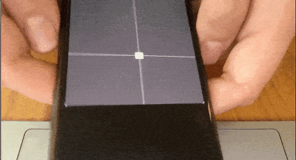

## Example of using the accelerometer on your device to control XY-values

Simple smoothing is applied to the input values to reduce jitter. 
(change the smoothSamples variable, smaller value makes the control
more responsive, larger value makes it more stable but with slower response)

by Eero Pitkänen
