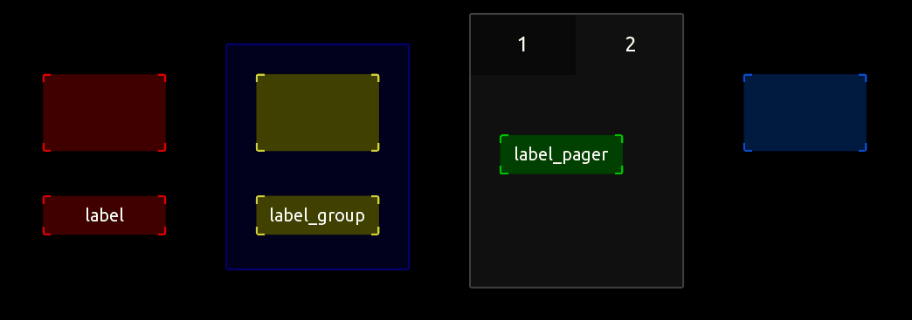

## How to address controls with 'parent' & 'children' in Lua

This template shows you how to address controls with
'parent' & 'children' to change their properties with Lua.

Depending on the pressed button we change the text of 
3 labels. One in the root of the template (red), one in a group 
(yellow) and one on a page in a pager (green).

The blue button uses handles to make the code more 
readable.

Have a look at the code in the buttons (double-click the group and pager to enter them and access the buttons).

Also take a look at the following example showing how to use the find() and findAll() in more detail: 
https://github.com/F-l-i-x/TouchOSC/tree/main/examples/find%26findAll