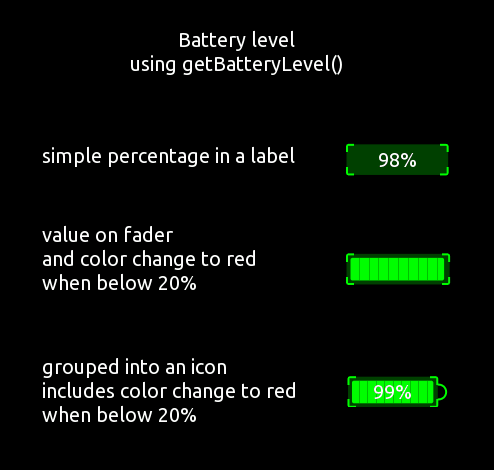
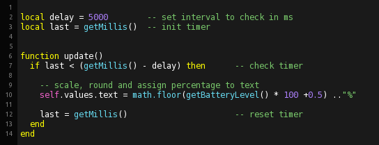

## 

### Overview

This example shows how to utilize the getBatteryLevel() function, and applies it to 3 different controls. 
The battery level is continuously checked every 5 seconds. Some controls use color changes to imprve visibility of low battery levels.

 

Here is the script of the included the label:

 

### getBatteryLevel() is currently (TouchOSC v1.1.0.132) not working under Android and will always return 1.0 (full battery)

A fix is expected soon.

---
