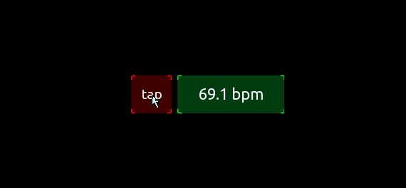
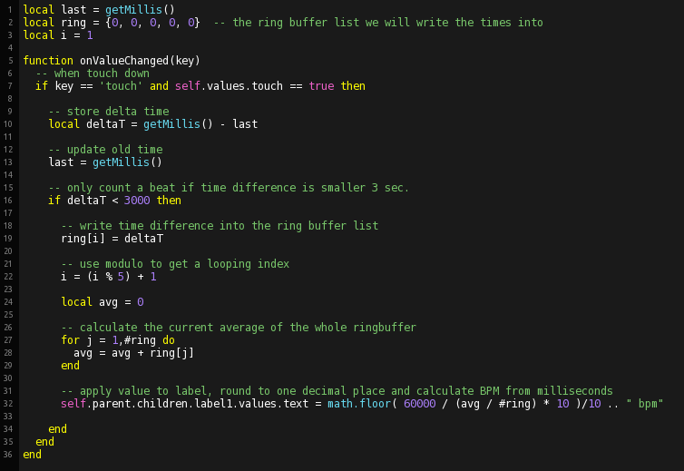

## Example for using timers to achieve delayed actions

Calculate a simple mean BPM values from a ring buffer of meassured times between button presses.



we use a list as a ringbuffer. Indexing by using modulo will cycle the needed index.



```lua

local last = getMillis()
local ring = {0, 0, 0, 0, 0}  -- the ring buffer list we will write the times into
local i = 1

function onValueChanged(key)
  -- when touch down
  if key == 'touch' and self.values.touch == true then
  
    -- store delta time 
    local deltaT = getMillis() - last
    
    -- update old time
    last = getMillis()

    -- only count a beat if time difference is smaller 3 sec.
    if deltaT < 3000 then   
  
      -- write time difference into the ring buffer list
      ring[i] = deltaT
      
      -- use modulo to get a looping index
      i = (i % 5) + 1
      
      local avg = 0
      
      -- calculate the current average of the whole ringbuffer
      for j = 1,#ring do
        avg = avg + ring[j]
      end
      
      -- apply value to label, round to one decimal place and calculate BPM from milliseconds
      self.parent.children.label1.values.text = math.floor( 60000 / (avg / #ring) * 10 )/10 .. " bpm"

    end
  end
end

```

---
