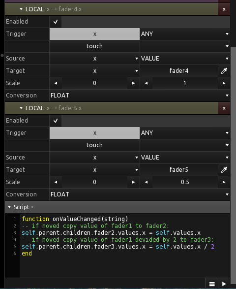

## Example for copying values by local messages and lua script

Here you can see the local messages (with scaling) for changing fader4 and fader5, and the script doing the same for fader2 and fader3.

Script example taken from Jörg Lengwenings, syntax inspired by Max Anderson.
