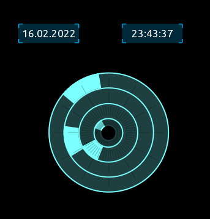

## 

### Overview

This example shows how to utilize the getDate() and getTime() function, and applies it to 2 separate labels, showing Date in non US and time in 24hrs format.
It also includes a useless clock, reading all 4 values from getTime().

 

---
