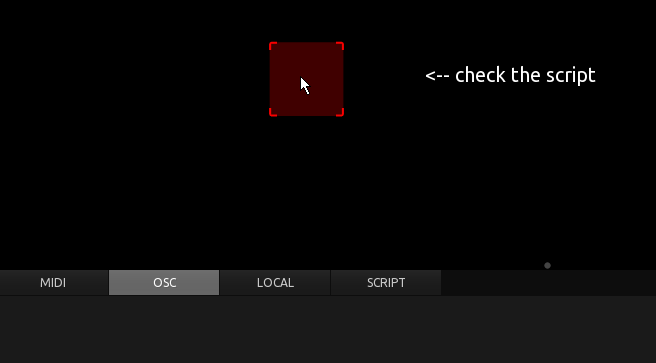
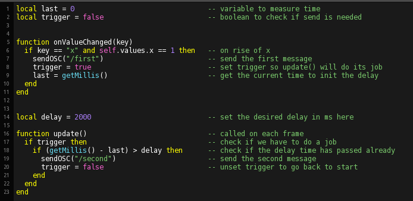

## Example for using timers to achieve delayed actions

Sends an OSC message and then another one 2 seconds later.

Makes use of 'update()', 'onValueChanged()', and getMillis().
OnValueChanged() sends the first OSC message, stores the current elapsed milliseconds and sets the trigger variable to 'true'.
Update() checks for 'trigger' and if its 'true', checks if the elapsed time has exceeded the given delay and in consequence sends the second message and resets trigger to 'false'.

