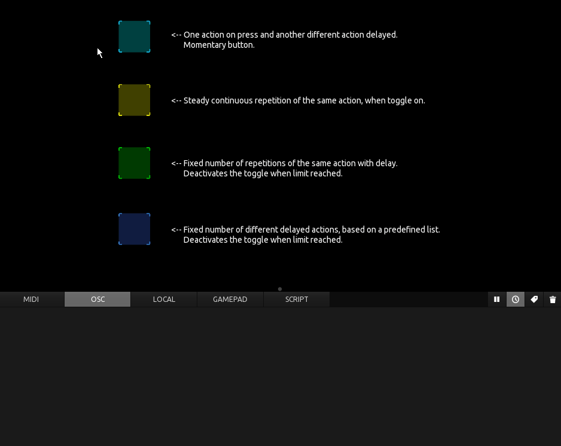
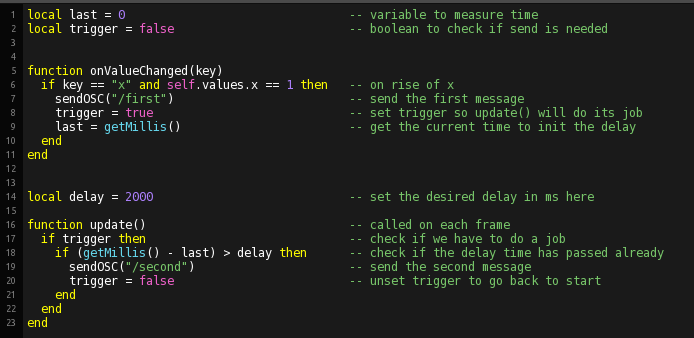
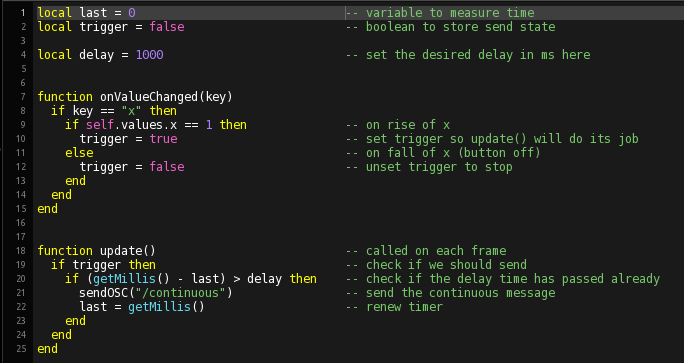

## 

Implements different repetitive and delayed actions via scripting, utilising a timer based on getMillis() and the update() function for non blocking functionality.

Here is the script from the first button, implementing two actions with delay.

Some hard- or software (like the Behringer X32) need continuous polling or subscription renewal in a given timeframe, the second button implents this:

