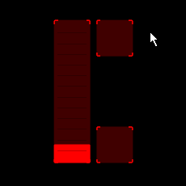

## Example for automatic fades

Two buttons, one fader.

Makes use of 'findByName', 'onReceiveNotify', 'update', 'onValueChanged'.

For further explanation, see the commented scripts on the buttons in the template.
