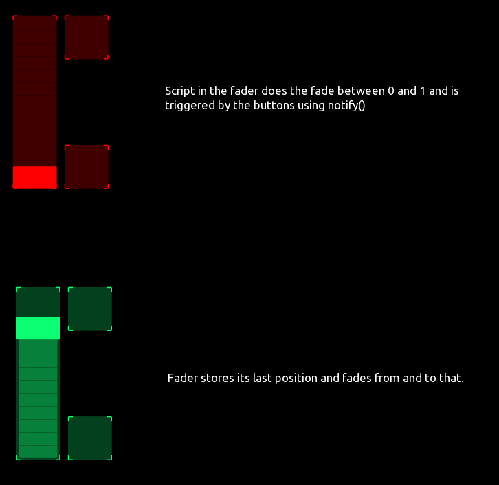
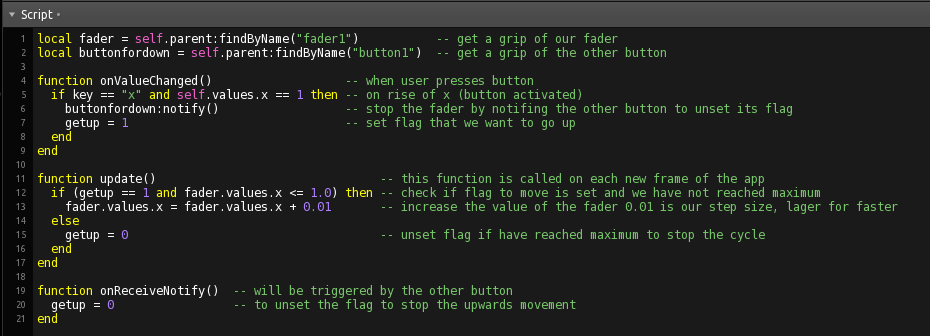
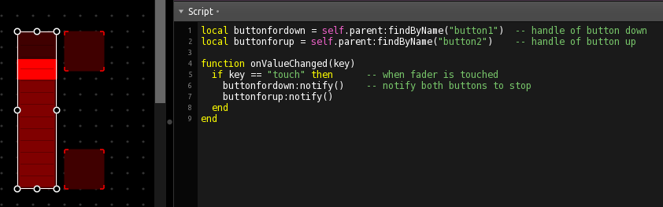

## Example for automatic fades

Two buttons, one fader.

The scripts make use of 'findByName()', 'onReceiveNotify()', 'update()', 'onValueChanged()'.

Script of a button:

Script in the fader to interrupt the movement when touched:

