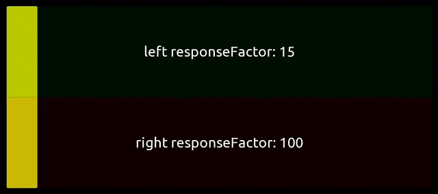

## Example for fader with user-definable two-value coarse / fine control.

One fader, two levels of control precision.

Using easy user-defined variables, you can set up a fader with precision side and a 1:1 movement side with a customisable split point.

The split runs along the movement direction of the fader, so can work in any orientation.

Included in the file is a Testing fader with controls for quickly trying out different responseFactors on the left or right, setting the split point, choosing your orientation, and a helpful overlay on the Testing fader to see how the split point and left / right responseFactors are applied to the fader.

The Production fader can be easily set up in the Script by setting the rF_left, rF_right and rF_split. This fader can then be copied to any project and the output x value can be used in the normal way via MIDI messages, OSC messages, or Local messages.

Further information is included in the Script itself, with comments to help break down what is going on.
