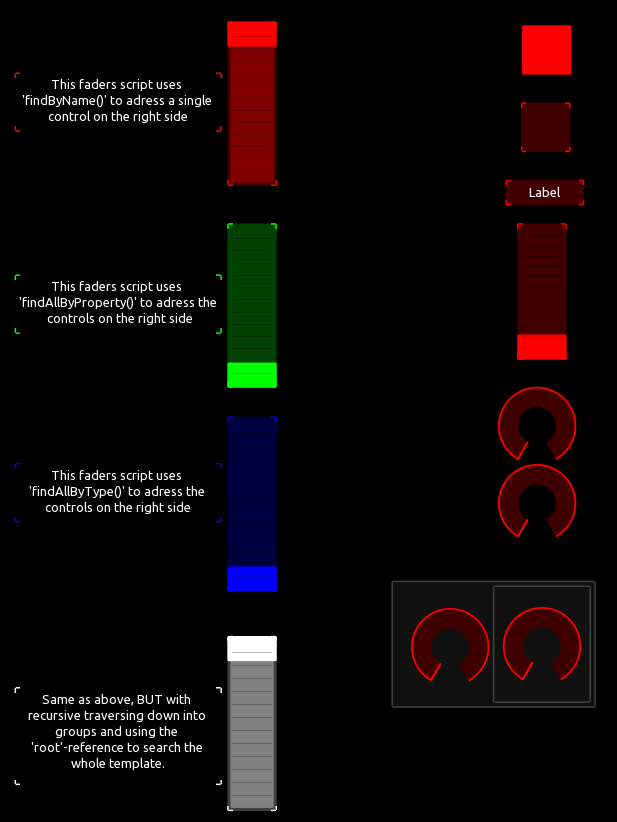
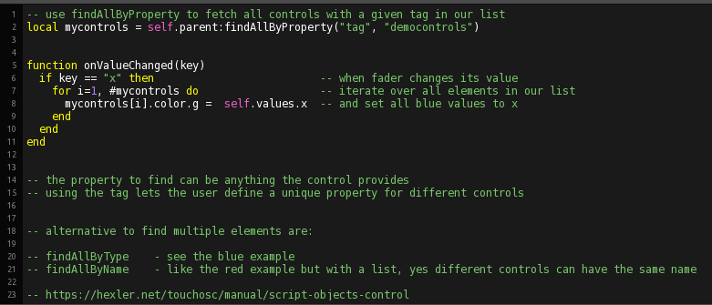
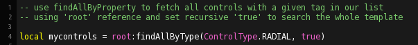

## 

This example shows how to use use the different 'find' functions.

 

The 'findAll' function returns a list of all found elements that can be iterated:

'find' and 'findAll' accept an optional boolean parameter, that will make the search descending recursively into all child elements from where it was called. Combining the recursive search with the 'root' reference will allow for a comfortable and complete template wide search from any point in your template.

Also take a look at another example about adressing controls by using 'parent.children...' https://github.com/F-l-i-x/TouchOSC/tree/main/examples/address_controls

See also https://hexler.net/touchosc/manual/script-objects-control for further information.

---
