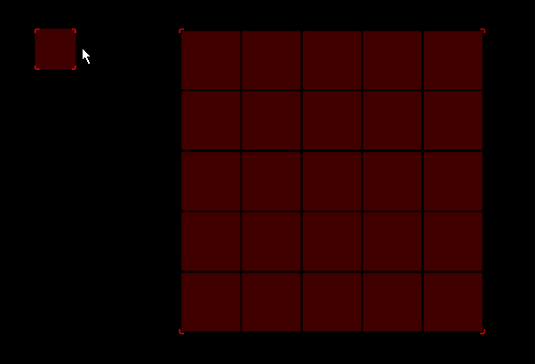
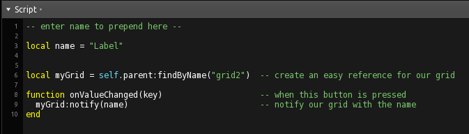
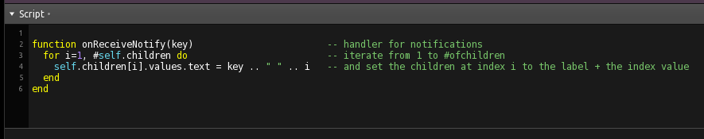
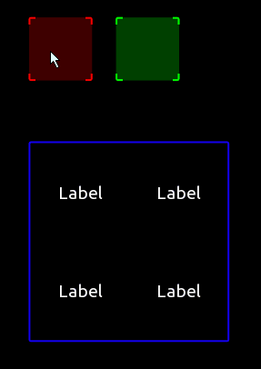

## Labeling a GRID by script

###  

This example shows how to use Lua to iterate over the children of a group (in this case a GRID), and how to index and access their properties, or values.

 

The Button to trigger the labeling notifies the grid with a given name, that the user can set in the script.

The grid then interates over all of its childs and prepends the name to the index number, thus creating numbered labels.

###  

A similar functionality, but done by directly adressing the lables and without any iteration.

 
