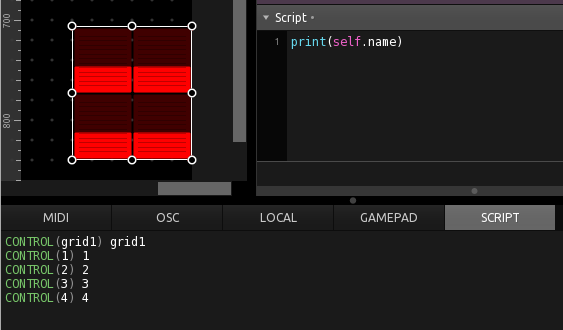
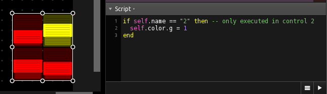
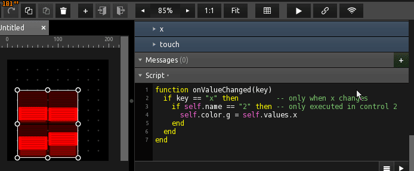
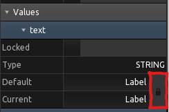
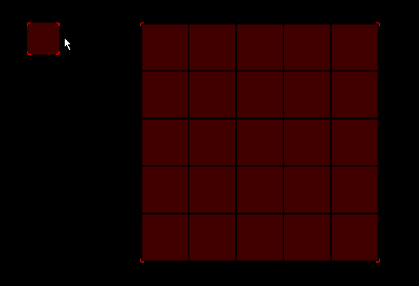
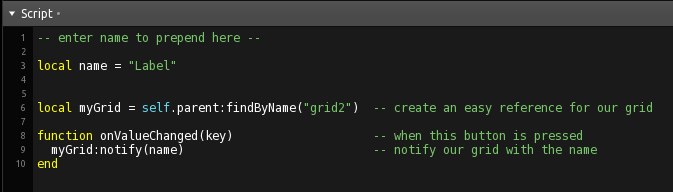
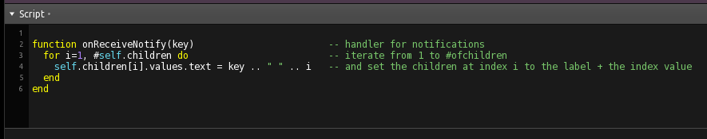
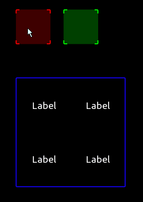
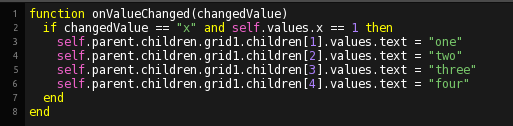

## Labeling a GRID by script

### General concept

GRIDs are basically grouped controls but they feature some already built in functionality like adaptive resizing and an exclusive mode for buttons. 
The script of a GRID is inherited to its children and will also be executed in their context. See the scripting log when a simple ```print(self.name)``` is put in a GRIDs script:




If you want to implement different fuctionality to different children of the GRID you can use the name as a condition: 
```lua
if self.name == "2" then 	-- only executed in control 2
  self.color.g = 1 		-- set green to 1
end
```


Or if you want to have it executed when a particular controls value changes:
```lua
function onValueChanged(key)
  if key == "x" then         		-- only when x changes
    if self.name == "2" then 		-- only executed in control 2
	    self.color.g = self.values.x	-- change green to controls value
    end
  end
end
```



...

### GRID with individual labels:

To ensure that a grid will keep the individual values of its childrens (especially labels), make sure to unlock "current" from "default" values as seen in the follwing picture:




###  

This example shows how to use LUA to iterate over the children of a group (in this case a GRID, but behaves the same), and how to index and access their properties or values.

 

The button to trigger the labeling notifies the grid with a given name, that the user can set in the script.



The grid then interates over all of its childs and prepends the name to the index number, thus creating numbered labels.




###  

A similar functionality, but done by directly adressing the lables from the buttons and without any iteration.

 

  
