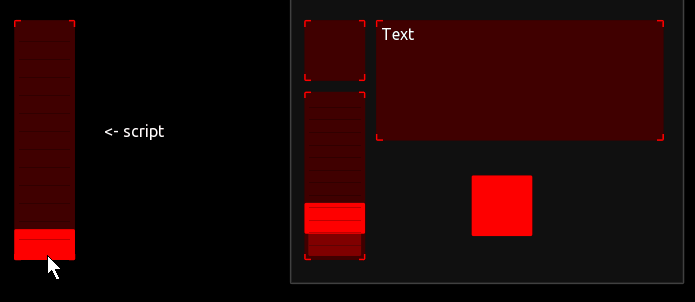
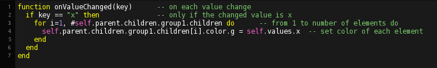
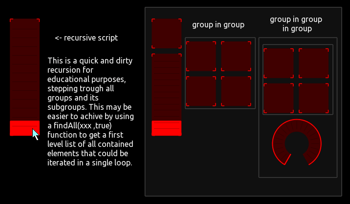
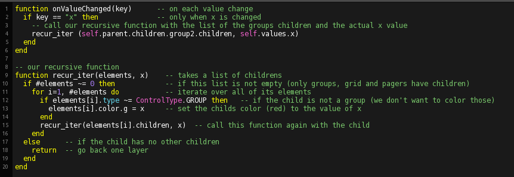

## 

Both examples in one template.

### simple single layer solution 

A for loop iterating over the list of group elements setting a color value.

 

### a recursive function solution to traverse trough all subgroups

 

---
