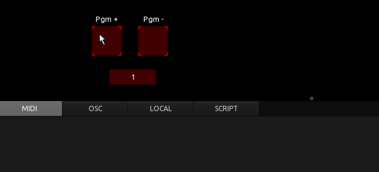
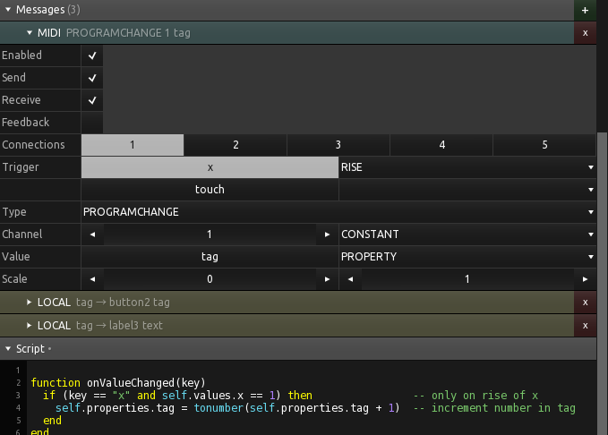
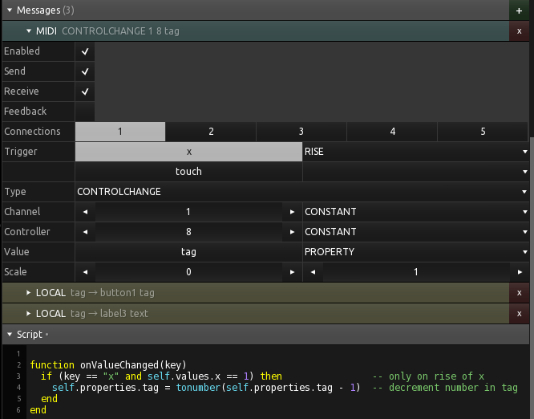
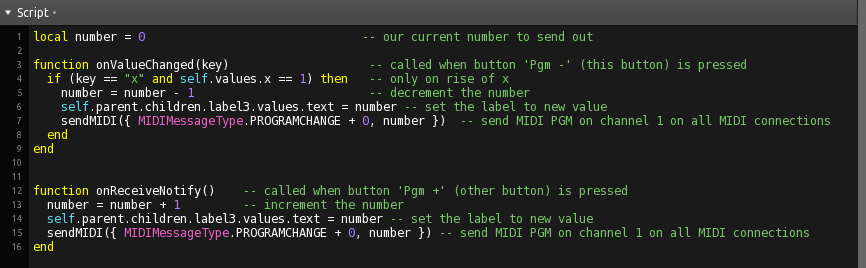

## Increment - decrement for MIDI messages

### 

Makes use of the 'tag' property of a button, to store a number beeing used in MIDI or other messages. 
Uses local messages between the buttons and the label to update the current variable, and a little script for the in- and decrement of the number in the tags.

 

Here you can see how 'tag' is used as a value in MIDI messages.

Here is another example using the tag as a CC value:

### 

The same funtionality, but without any local messages and without the 'tag' workaround. Therefore MIDI messages must be sent from script aswell. 
The first button stores the number as a local variable and does all the job of in/dec and sending the midi messages. The second button just notifys the first to do something. 

