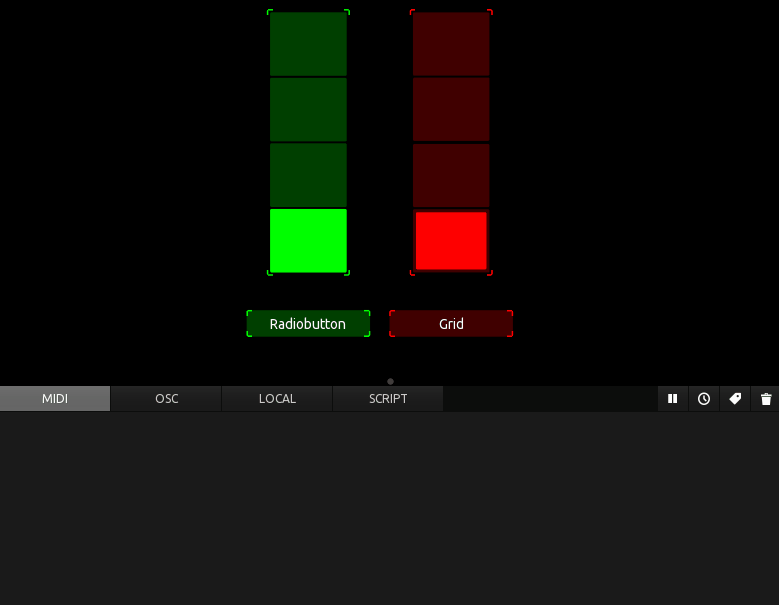

## Multitoggle examples (exclusive mode)

### 

Dedicated but not restricted to MIDI. All MIDI messages can be set in the scripts individually.

### 

 

A simple multitoggle derived from a copied control from TouchOSC Mk1. Each button can have its own and independent MIDI messages.
Not convenient, not scaleable but usable. Includes scripts to unset the other buttons for 'exclusive mode'.

Acts as in exclusive mode: When clicked, a button in the group sends its index to its parent (the group)), and the group then
iterates over all of its children (the buttons) and unsets them except for the one which triggered it.