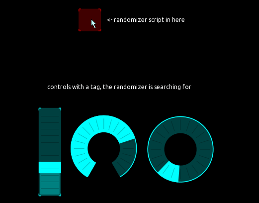
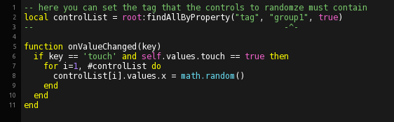

## randomizer for a set of controls

This example shows how to create a randomizer for a set of controls by using their 'tag' property

 

The script doeas a global recursive search for a certain 'tag' property and stores the references in a list, which is then iterated and each controls x value is set to random between 0. and 1.

 

See also https://github.com/F-l-i-x/TouchOSC/tree/main/examples/find%26findAll and https://hexler.net/touchosc/manual/script-objects-control for further information.

---
