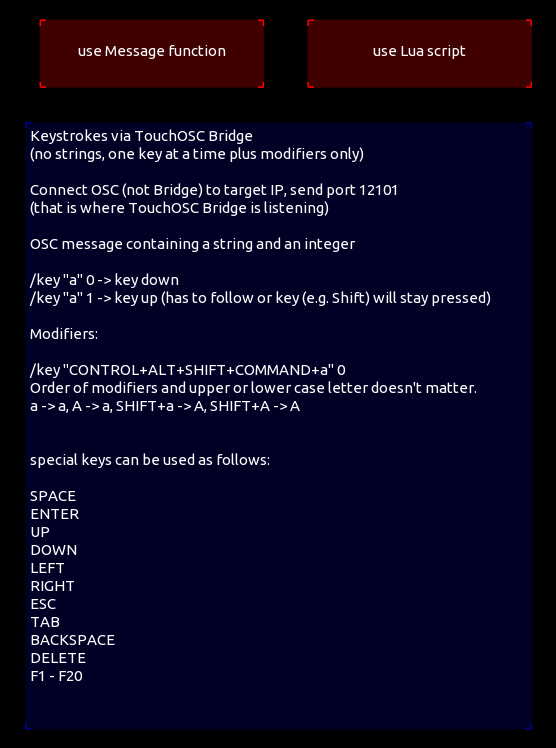

## Example for sending keystrokes to TouchOSC Bridge by local messages and lua script

This was part of the native functionality of MK1, but is no longer available in MK2.
It can still be achieved by sending certain OSC messages to TouchOSC bridge.
This example shows you how. Everything is explained inside the template.

by Jörn Lengwenings
