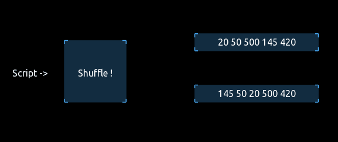
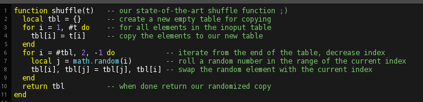

## 

### Overview

This example implements a Fisher-Yates- aka Knuth- aka Durstenfeld-shuffle algorithm to efficiently and randomly shuffle the contents of a table. 

 

### Background: 
Shuffling a table or an array of values is a classical optimization problem in computer science and often used to teach time complexity of algorithms. Most quick and dirty solutions won't be much better then O(n²), which means the time cost (cpu time) to solve the problem will scale quadratic to the number of elements in the array/table.
In 1964 Richard Durstenfeld described an efficient (and elegant) algorithm that brought time complexity down to linear behaviour, O(n). But since his algorithm was very close to an older description from two statisticians from the 1930s, its mostly called the "Fisher-Yates"-shuffle and also known as "Knuth"-shuffle after Donald Knuth who made Durstenfelds algorithm popular in 1969.
These topics are a whole research field on its own, called linear programming, and are very very important for the technological advancements in mostly all engineering fields today. 

### The algorithm
Durstenfeld achieved his linear inplace shuffle by iterating from the end of the table to the beginning, and for each index selecting a random element out of the remaining range and swapping it with the indexed one.
The implementation here is doing a copy of the table first to keep the original data available.

 

One interresting takeaway for LUA beginners should be the line `tbl[i], tbl[j] = tbl[j], tbl[i]` :
Because LUA allows for multiple assignments in the same line but firstly evaluates all values before it executes them, we can swap the fields without needing a third temporary storage field.

---

For further information see also: 
- https://en.wikipedia.org/wiki/Fisher%E2%80%93Yates_shuffle
- https://bost.ocks.org/mike/shuffle/
- https://blog.codinghorror.com/the-danger-of-naivete/

---
