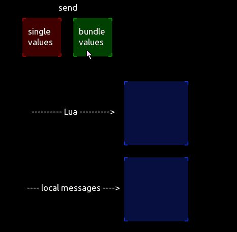

## Two examples for setting properties by local messages and lua script

[properties_localmessage.tosc (no Lua):](properties_localmessage.tosc)

 

[set_button_size_and_position.tosc (with Lua):](set_button_size_and_position.tosc)

Bundled local messages must be set to CONSTANT and its conversion to STRING.
Color bundles must be provided in HEX. Frame bundles must be 4 values (x;y;w;h) separated by semicolons.

