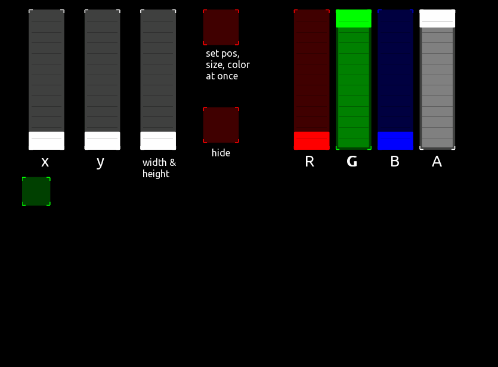
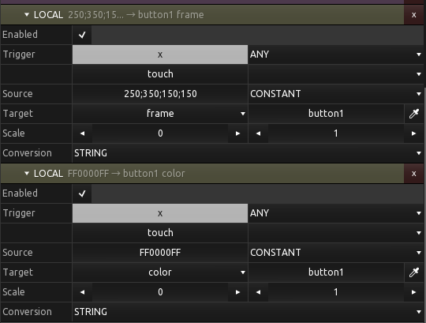

## Two small examples for setting properties by local messages and lua script

Including single and budles messages.

 

Bundled local messages must be set to CONSTANT and its conversion to STRING.
Color bundles must be provided in HEX and frame bundles must be 4 values separated by semicolons.

