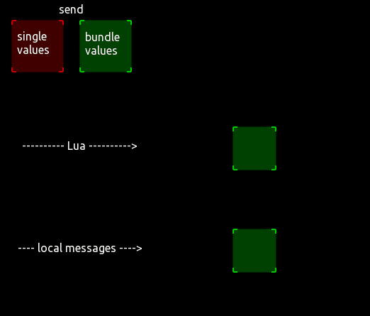

## Two examples for setting properties by local messages and lua script

[properties_localmessage.tosc (no Lua):](properties_localmessage.tosc)

 

[size_color_position_LuaAndLocal.tosc (with Lua):](size_color_position_LuaAndLocal.tosc)

Bundled local messages must be set to CONSTANT and its conversion to STRING.

Color bundles must be provided in HEX. (RRGGBBAA)
Frame bundles for local must be 4 values (x;y;w;h) separated by semicolons. 
Frame bundles for Lua can be packed by the Rectangle() function.

