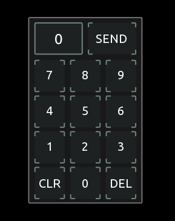

# A collection of reusable modules

## Overview

The containing modules are an early approach to achieve reusability of grouped tosc controls for different applications. They use minimal to heavy scripting and can be copied directly into your own project. ENJOY!

---

## 

A easy to use scrollable dropdown menu with up to 10 elements.

---

## 

A easy to use static dropdown menu with up to 10 elements.

---

## 

Known from TouchOSC Mk1, here are 4 different implementations of exclusive multitoggles.

---

## 

A foldable numpad to change other controls or to directly send the MIDI or OSC commands of your desire.

  

---
There are some workarounds implemented to prevent current issues of Touch OSC, but i can not guarantee 100% functionality or reliability. 
This is a first proof of concept prototype for user modules, with a somehow defined interface, but my aim is to extend or change this to a practical, understandable and reliable almost standard, a userbase can agree on and progress with. 
Using the 'tag' is a very limited workaround, that fits the use case of this numpad, but also is the only practical one to achieve local messages with, so far. Which i think is madatory for the acceptance of basic modules for users with no experience or interest in scripting.
---

