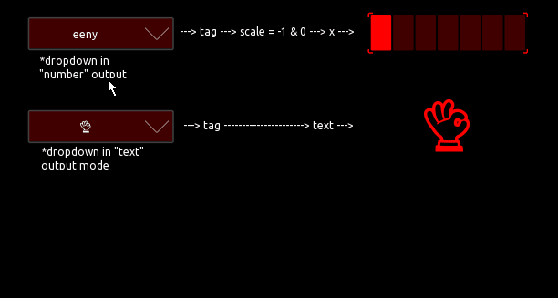

# A collection of reusable modules

## Overview

The containing modules are an early approach to achieve reusability of grouped tosc control for different application. They use less to heavy scripting and can be copied directly into your own project.

## _Dropdown menu scrollable_

## Dropdown menu static

---
There are some workarounds implemented to prevent current issues of Touch OSC, but i can not guarantee 100% functionality or reliability. 
This is a first proof of concept prototype for user modules, with a somehow defined interface, but my aim is to extend or change this to a practical, understandable and reliable almost standard, a userbase can agree on and progress with. 
Using the 'tag' is a very limited workaround, that fits the use case of this numpad, but also is the only practical one to achieve local messages with, so far. Which i think is madatory for the acceptance of basic modules for users with no experience or interest in scripting.
---

