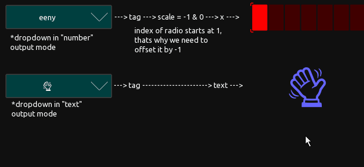

# A collection of reusable modules

## Overview

The modules here are an early approach to achieve reusability of user made TOSC controls for different applications. 
They are free to use and can easily be copied into your own project.
ENJOY!

---

## 

An easy to use scrollable dropdown menu with up to 10 elements, configurable unfold size and two different outputmodes usable for local, MIDI and OSC messages.
Parameters are set by script but there is no scripting knowledge necessary to use it.

---

## 

An easy to use static dropdown menu with up to 10 elements and two different outputmodes usable for local, MIDI and OSC messages. 
Parameters are set by script but there is no scripting knowledge necessary to use it.

---

## 

Known from TouchOSC Mk1, this are 4 different implementations of exclusive multitoggles.

---

## 

A foldable numpad to change other controls or to directly send the local, MIDI or OSC commands of your desire.

---

