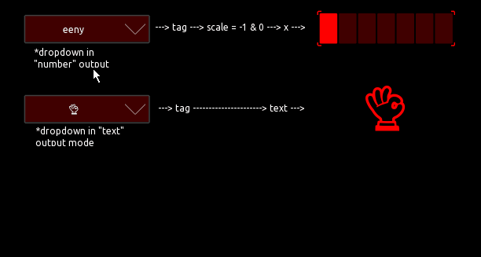

# A basic dropdown menu module for reuse in other projects

## Overview

It can simply be pasted to your project from the  template.

 

## Interface

### To other controls

The dropdown is a group control and can interface to to other controls trough local messages via its tag property. The tag will be updated when an element is selected after opening the menu, as well as the touch value, to trigger the events in local messages.

### Direct MIDI and OSC messages

Like the local messages, the dropdown can also send MIDI or OSC messages directly. The user just needs to use touch as trigger and tag as the source. Here is a shot from the examples in the template.

## Settings
 
### Changing the elements

---
There are some workarounds implemented to prevent current issues of Touch OSC, but i can not guarantee 100% functionality or reliability. 
This is a first proof of concept prototype for user modules, with a somehow defined interface, but my aim is to extend or change this to a practical, understandable and reliable almost standard, a userbase can agree on and progress with. 
Using the 'tag' is a very limited workaround, that fits the use case of this numpad, but also is the only practical one to achieve local messages with, so far. Which i think is madatory for the acceptance of basic modules for users with no experience or interest in scripting.
---

