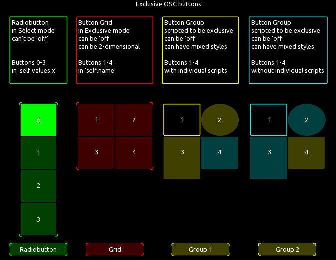

# 4 variations of a multitoggle in exclusive mode

Can send individual MIDI/OSC messages when a button is turned on, superseded and turned off.
Can additionally send a MIDI/OSC message when ANY button is turned on or off.
Messages and target connections (per message) can be set in the script.

 

To understand which messages are sent in which situation try the OSC version of the multitoggles
as the OSC messages contain "on / super(seded) / off" which is easier to follow.

Look at the scripts for further explanations.

Read more on the syntax for MIDI messages [here](https://hexler.net/touchosc/manual/script-examples#sending-midi-messages) and on available MIDI message types [here](https://hexler.net/touchosc/manual/script-enumerations#midimessagetype).  
Read more on the syntax for OSC messages [here](https://hexler.net/touchosc/manual/script-examples#sending-osc-messages).

The predecessor - a simple multitoggle example - can be found [here](https://github.com/F-l-i-x/TouchOSC/tree/main/examples/multitoggle_1d)

by Jörn Lengwenings

