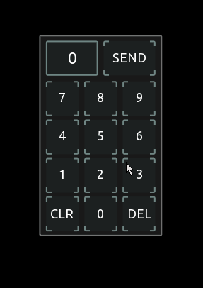
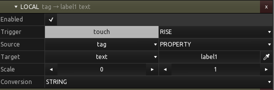
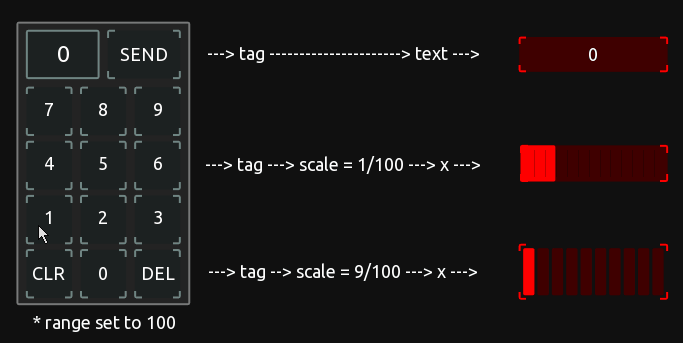
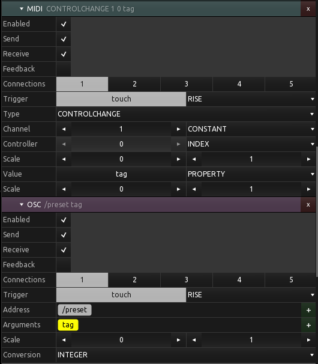
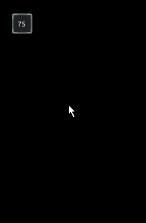
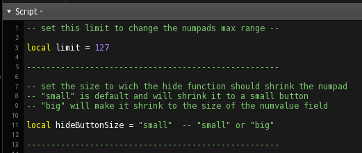

# A basic integer numberpad module for reuse in other projects

## Overview

The design of this module is a first approach to achieve reusability of user generated templates within the new version of TouchOSC.

It features a user definable range, a delete for single digits and a clear function and a variable hide functionality which will shrink the numpad to a very small or bigger button.

It can simply be pasted to your project from the  template.

 

## Interface

### To other controls

The numpad is a group control and can interface to to other controls trough local messages via its tag property. The tag will be updated when SEND is pressed, as well as the touch value, to trigger the events in the local messages.
Here is an example from the template where you can see how to use the tag to set a label (and other controls).

 

### Direct MIDI and OSC messages

Like the local messages, the numpad can also send MIDI or OSC messages directly. The user just needs to use touch as trigger and tag as the source. Here is a shot from the examples in the template.

### Hide functionality

When the number display is clicked, the numpad will shrink to one of two possible settings, big or small. This allows for slick integration in other templates without wasting too much space.

 ---------  

The size is stored inside of the control and the last state will persist even when switching from edit to live mode and back.

## Settings
 
### Changing the number range and the size of the button when hidden

The numpads range can be set in the script. It is limited to positive integers at the moment.
The hideButtonSize defines how small the group should geht when hidden.

---
There are some workarounds implemented to prevent current issues of Touch OSC, but i can not guarantee 100% functionality or reliability. 
This is a first proof of concept prototype for user modules, with a somehow defined interface, but my aim is to extend or change this to a practical, understandable and reliable almost standard, a userbase can agree on and progress with. 
Using the 'tag' is a very limited workaround, that fits the use case of this numpad, but also is the only practical one to achieve local messages with, so far. Which i think is madatory for the acceptance of basic modules for users with no experience or interest in scripting.
---

Many thanks to Bryan Day for the inspiration of building such a module and the idea of including the hiding functionality. Additional thanks to Jörn Lengwenings for the useful feedback.

